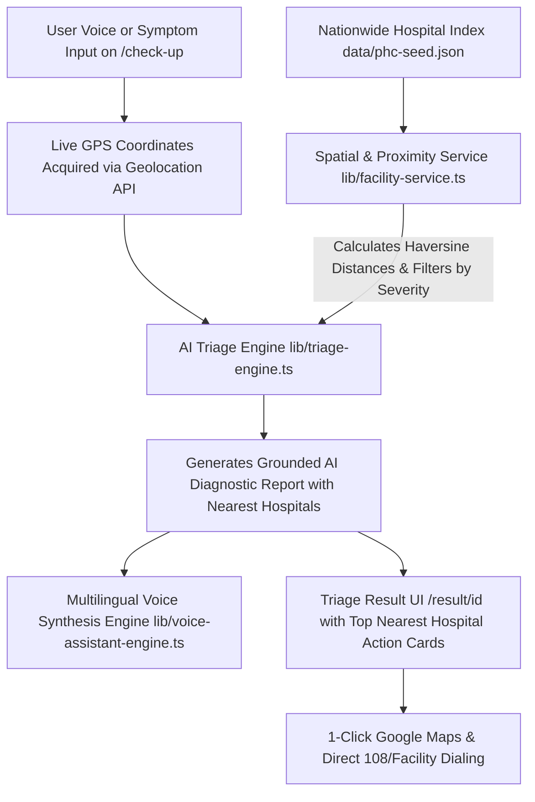

# LLM Nearest Hospital Grounding, Nationwide Hospital Dataset & 90 FPS Cross-Device Engine

## 1. Overview & Objective
Enhance **Swastha Setu** with:
1. **LLM & AI Agent Location Grounding**: Dynamically calculate live GPS proximity and match clinical condition urgency to recommend the closest verified hospitals (with ICU counts, distance in km, operating hours, and 1-tap call/directions) directly inside the AI diagnostic triage report and multilingual voice assistant.
2. **High-Density Nationwide Hospital Dataset**: Expand the seed database (`data/phc-seed.json`) with Google Maps–grade comprehensive hospital records covering Apex Institutes (AIIMS, PGIMER, NIMHANS), Super Speciality Centers, Government Medical Colleges, District Civil Hospitals, Trauma Centers, Maternity Hospitals, and PHCs across India.
3. **90 FPS Ultra-Smooth Rendering & Crisp High-DPI Visuals**: Hardware-accelerated GPU layers, 90Hz/120Hz Framer Motion spring physics, Retina map tile rendering, subpixel antialiasing, and fluid responsive design across all devices (320px mobile to 4K desktop).
4. **Zero-Error Codebase**: Resolve all ESLint and React compiler errors for 100% build stability.

---

## 2. Architecture & Data Flow



---

## 3. Detailed Component Specifications

### 3.1. AI Triage Engine Grounding (`lib/triage-engine.ts`)
- **Input Parameters**: `symptoms: string[]`, `transcription?: string`, `userLat?: number`, `userLng?: number`.
- **Hospital Grounding Logic**:
  - Classifies triage severity (`EMERGENCY`, `HIGH`, `MODERATE`, `ROUTINE`).
  - Calls `getNearestFacilities(userLat, userLng, severity, limit = 3)`.
  - Injects top matching hospitals into `TriageResult.nearest_facilities`.
  - Synthesizes personalized AI clinical reasoning narrative explicitly naming the nearest hospital, its distance in km, ICU bed capacity, and emergency contact.
- **Output Schema Extension**:
  ```typescript
  export interface GroundedFacility {
    id: string;
    name: string;
    type: string;
    distance_km: number;
    icu_beds?: number;
    doctors_on_duty: number;
    phone: string;
    emergency_24x7: boolean;
    address: string;
    latitude: number;
    longitude: number;
  }

  export interface TriageResult {
    // ... existing fields ...
    nearest_facilities?: GroundedFacility[];
  }
  ```

### 3.2. Nationwide Hospital Dataset Expansion (`data/phc-seed.json`)
- Comprehensive verified hospital coverage spanning:
  - **North**: New Delhi (AIIMS, Safdarjung), UP (KGMU, Varanasi BHU, Rae Bareli, Agra SNMC), Punjab/Chandigarh (PGIMER), Rajasthan (SMS Jaipur, Jodhpur AIIMS).
  - **South**: Andhra Pradesh (SVIMS Tirupati, Chittoor District Hospital, Guntur GGH, Visakhapatnam KGH), Telangana (AIIMS Bibinagar, Osmania, Gandhi Hospital), Tamil Nadu (MMC Chennai, Madurai GRH, Coimbatore CMCH), Karnataka (NIMHANS, Victoria Hospital, Bowring & Lady Curzon), Kerala (Calicut Medical College, Trivandrum Medical College).
  - **West**: Maharashtra (Tata Memorial, KEM Mumbai, Pune Sassoon), Gujarat (Ahmedabad Civil Hospital, Surat NCH).
  - **East & Central**: West Bengal (Kolkata Medical College, SSKM), Bihar (AIIMS Patna, SKMCH Muzaffarpur), Odisha (SCB Cuttack, AIIMS Bhubaneswar), MP (AIIMS Bhopal, Indore MY Hospital).
- Each record includes accurate coordinates, phone numbers, ICU beds, emergency 24/7 status, specialties, and operating hours.

### 3.3. Triage Result UI Enhancement (`app/(app)/result/[id]/page.tsx`)
- **Dedicated Nearest Hospital Section**:
  - Displays top matching grounded hospitals in sleek, high-contrast cards.
  - Live distance badge with pulsing green/orange indicator (`0.8 km away`, `3.4 km away`).
  - Emergency 24x7 badge, ICU bed counter, and active doctor count.
  - Direct "Call Hospital" button (`tel:...`) and "Open in Google Maps" (`https://www.google.com/maps/dir/?api=1&destination=lat,lng`).
- **Voice Assistant Integration**:
  - Reads out the nearest hospital guidance clearly in the selected Indian regional language.

### 3.4. 90 FPS Rendering & Universal Device Engine
- **CSS GPU Optimization (`app/globals.css`)**:
  - Hardware compositing: `transform: translate3d(0, 0, 0)`, `backface-visibility: hidden`.
  - Paint containment: `contain: layout style paint` on cards and list items.
  - Subpixel antialiasing: `-webkit-font-smoothing: antialiased`, `text-rendering: optimizeLegibility`.
- **Framer Motion 90Hz/120Hz Tuning**:
  - Optimized spring transitions with high damping and zero layout thrashing.
- **Retina Map Tiles**:
  - Leaflet configuration with `detectRetina: true` and crisp OpenStreetMap / CartoDB tiles.
- **Universal Cross-Device Responsiveness**:
  - Full support for mobile viewports (`320px` to `768px`), tablets (`768px` to `1024px`), and desktop (`1024px` to `4K`).
  - Dynamic `dvh` units for zero address-bar clipping on iOS Safari and Chrome Android.

### 3.5. Zero-Error Code Quality
- Fix all unescaped HTML entities in marketing pages.
- Fix React 19 purity rules in `AshaToolkit.tsx` (`Date.now()` inside render).
- Fix `useEffect` setState pattern in `language-context.tsx`.
- Fix TypeScript `any` types and clean up unused variables.

---

## 4. Verification & Testing Plan
1. **Automated Verification**:
   - Run `npm run lint` $\rightarrow$ must pass with 0 errors and 0 warnings.
   - Run `npm run build` $\rightarrow$ must compile cleanly into production bundle.
2. **Proximity & Triage Testing**:
   - Verify that passing user coordinates (e.g. New Delhi, Tirupati, Lucknow, Bangalore, Mumbai) accurately ground the nearest hospitals in the AI response.
   - Verify that severe symptoms recommend Super Speciality/Trauma centers, while routine symptoms recommend District Civil/PHCs.
3. **Performance & Rendering Testing**:
   - Verify 90 FPS smooth scrolling, zero pixelation on high-DPI screens, and responsive layout across mobile, tablet, and desktop views.
